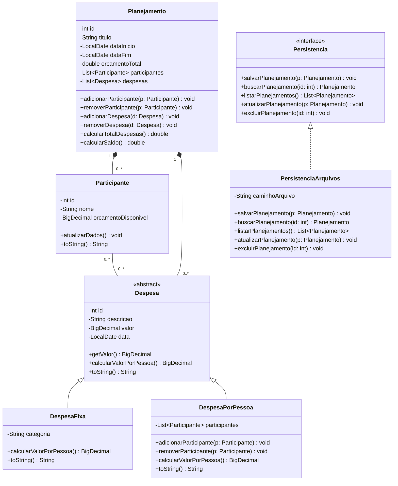

# Diagrama de Classes UML — Cabe no Bolso

Este diagrama representa a estrutura de classes do sistema,
seus atributos, métodos e relacionamentos.

```mermaid

classDiagram
direction TB

class Planejamento {
  -int id
  -String titulo
  -LocalDate dataInicio
  -LocalDate dataFim
  -double orcamentoTotal
  -List~Participante~ participantes
  -List~Despesa~ despesas
  +adicionarParticipante(p: Participante) void
  +removerParticipante(p: Participante) void
  +adicionarDespesa(d: Despesa) void
  +removerDespesa(d: Despesa) void
  +calcularTotalDespesas() double
  +calcularSaldo() double
}

class Participante {
  -int id
  -String nome
  -BigDecimal orcamentoDisponivel
  +atualizarDados() void
  +toString() String
}

class Despesa {
  <<abstract>>
  -int id
  -String descricao
  -BigDecimal valor
  -LocalDate data
  +getValor() BigDecimal
  +calcularValorPorPessoa() BigDecimal
  +toString() String
}

class DespesaFixa {
  -String categoria
  +calcularValorPorPessoa() BigDecimal
  +toString() String
}

class DespesaPorPessoa {
  -List~Participante~ participantes
  +adicionarParticipante(p: Participante) void
  +removerParticipante(p: Participante) void
  +calcularValorPorPessoa() BigDecimal
  +toString() String
}

class Persistencia {
  <<interface>>
  +salvarPlanejamento(p: Planejamento) void
  +buscarPlanejamento(id: int) Planejamento
  +listarPlanejamentos() List~Planejamento~
  +atualizarPlanejamento(p: Planejamento) void
  +excluirPlanejamento(id: int) void
}

class PersistenciaArquivos {
  -String caminhoArquivo
  +salvarPlanejamento(p: Planejamento) void
  +buscarPlanejamento(id: int) Planejamento
  +listarPlanejamentos() List~Planejamento~
  +atualizarPlanejamento(p: Planejamento) void
  +excluirPlanejamento(id: int) void
}

Planejamento "1" *-- "0..*" Participante
Planejamento "1" *-- "0..*" Despesa
Participante "0..*" -- "0..*" Despesa
Despesa <|-- DespesaFixa
Despesa <|-- DespesaPorPessoa
Persistencia <|.. PersistenciaArquivos
```
